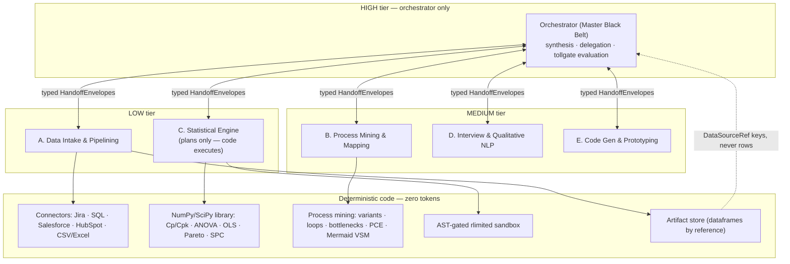

# LSS Co-Pilot

A hierarchical multi-agent platform that automates the analytical heavy lifting of the
Lean Six Sigma **DMAIC** framework: a high-reasoning orchestrator delegates all execution
to specialized, low-cost sub-agents, with deterministic math everywhere a number is produced.

## Architecture



### Token-efficiency design (the load-bearing decisions)

1. **Tier routing is structural, not prompted.** Every sub-agent class declares a
   `ModelTier`; the `LLMRouter` maps tier → model. A LOW-tier agent *cannot* spend
   HIGH-tier tokens. In a full DMAIC run the HIGH model is invoked **exactly once**
   (root-cause synthesis in ANALYZE) — enforced by a test.
2. **Data travels by reference.** Dataframes are parked in the `ArtifactStore` and
   agents exchange `DataSourceRef` handles. Rows never enter LLM context; when the
   intake agent needs help mapping columns, it sends column *names and dtypes* only.
3. **Numbers come from code.** The Statistical Engine's LLM emits an `AnalysisPlan`
   (which library calls, which columns); NumPy/SciPy produce every statistic, p-value,
   Cp/Cpk, and control limit. Custom analyses run in an AST-allowlisted, rlimited
   subprocess sandbox and return JSON. FMEA RPN is a `computed_field` — a model
   physically cannot emit an inconsistent RPN.
4. **State is one validated object.** `LSSProjectState` (Pydantic) threads through a
   LangGraph state machine; every handoff is a typed `HandoffEnvelope` carrying token
   usage into a per-agent `TokenLedger` for observability.

## DMAIC flow

| Phase | What runs | Tier spend |
|---|---|---|
| **Define** | Qualitative agent drafts `ProjectCharter` + SIPOC from the rough problem text | MEDIUM |
| *tollgate* | LangGraph `interrupt()` — human approves before any data is pulled | — |
| **Measure** | Intake pulls & normalizes events → Mining computes baseline (cycle time, defect rate, PCE, Mermaid VSM, bottlenecks) | LOW + MEDIUM |
| **Analyze** | Stat engine executes Pareto/regression/hypothesis tests; NLP agent builds fishbone + FMEA; orchestrator fuses both into ≤3 verified `RootCause`s | LOW + MEDIUM + **one HIGH call** |
| *tollgate* | Human reviews root causes | — |
| **Improve** | Prototyping agent drafts automations (Python / Make / Zapier / Firebase), statically vetted before storage | MEDIUM |
| *tollgate* | Human approves rollout | — |
| **Control** | `SPCMonitor` polls the source connector, evaluates Western Electric rules against frozen UCL/LCL, pushes alerts to Power BI / Streamlit | **zero tokens** |

## Layout

```
src/lss_copilot/
├── config.py            # ModelTier routing + all secrets via env (LSS_*)
├── state/schemas.py     # Pydantic artifacts, HandoffEnvelope, LSSProjectState
├── orchestrator/        # LangGraph DMAIC graph + the only HIGH-tier prompts
├── agents/              # the five sub-agents + tier-enforced LLM router
├── connectors/          # Jira · SQL · Salesforce · HubSpot · CSV/Excel → event log
├── mining/              # process mining, PCE, Mermaid VSM
├── stats/               # descriptive · Cp/Cpk · hypothesis · OLS · Pareto · SPC
├── tools/               # sandbox (AST + rlimits) · artifact store
├── control/             # SPC monitor polling loop + control plan
└── dashboard/           # Streamlit app · Power BI streaming push
```

## Quick start

```bash
pip install -e ".[dashboard,dev]"
pytest                                       # offline: stub LLM, no API key needed

export LSS_ANTHROPIC_API_KEY=sk-ant-...
python examples/run_dmaic.py events.csv "Ticket resolution takes 4x longer than target..."
streamlit run src/lss_copilot/dashboard/streamlit_app.py -- --state <project>_state.json
```

Connector credentials (`LSS_JIRA_*`, `LSS_SQL_DSN`, `LSS_SALESFORCE_*`,
`LSS_HUBSPOT_ACCESS_TOKEN`, `LSS_POWERBI_PUSH_URL`) are read from the environment or a
local `.env` — see `config.py` for the full list.
